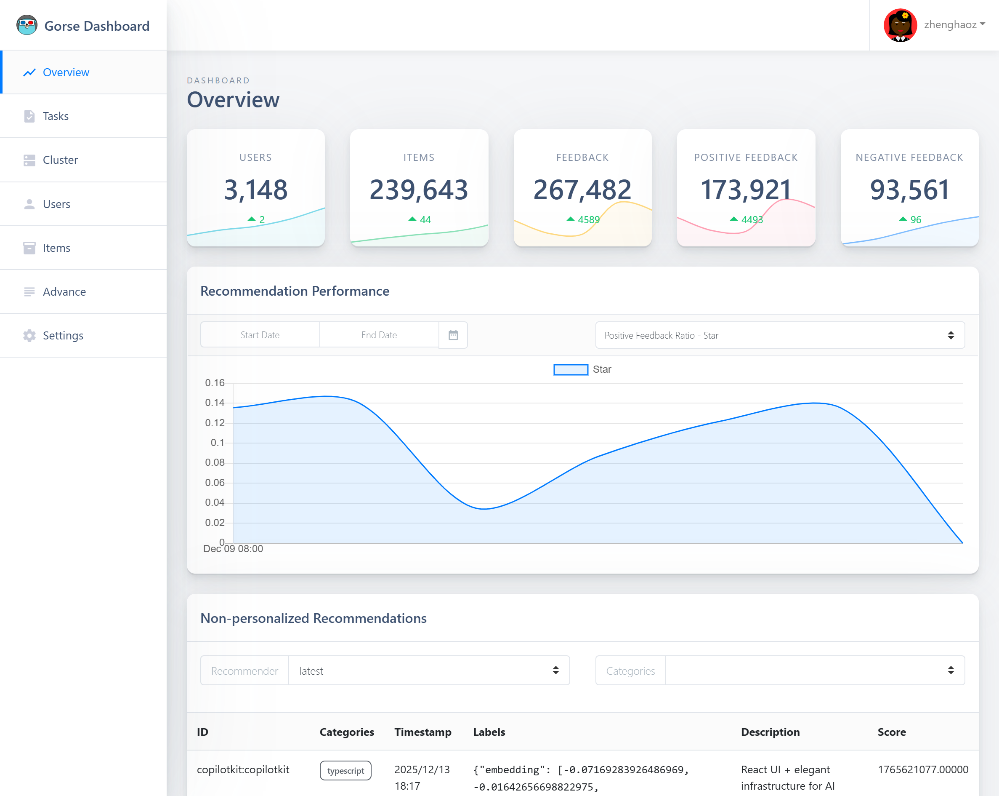

# Dashboard for gorse recommender system

[](https://github.com/gorse-io/dashboard/actions/workflows/build.yml)

An admin dashboard for gorse recommender system derived from [shards-dashboard-vue](https://github.com/DesignRevision/shards-dashboard-vue).



## Quick Start

1. Install Node 18+ and `pnpm`.
2. Install dependencies by running `pnpm install`.
3. Run `pnpm dev` to start the local development server.
4. Run `pnpm build` to create a production bundle.

> - For Node 24+, legacy transitive dependency build scripts are skipped automatically via `pnpm.neverBuiltDependencies`.
> - [Node Version Manager](http://nvm.sh/) is recommended for managing multiple Node versions on a single machine.

## Usage

Install the package.

```bash
go get -u github.com/gorse-io/dashboard@statik
```

Import and serve.

```go
import (
  "github.com/rakyll/statik/fs"
  
  _ "github.com/gorse-io/dashboard"
)

  // ...

  statikFS, err := fs.New()
  if err != nil {
    log.Fatal(err)
  }
  
  // Serve the contents over HTTP.
  http.Handle("/", http.FileServer(statikFS))
  http.ListenAndServe(":8080", nil)
```
